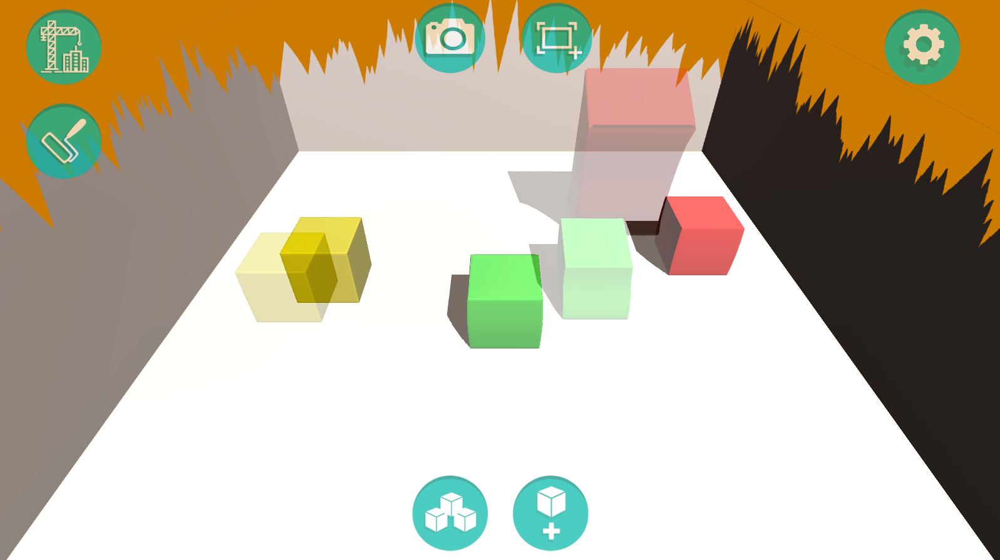
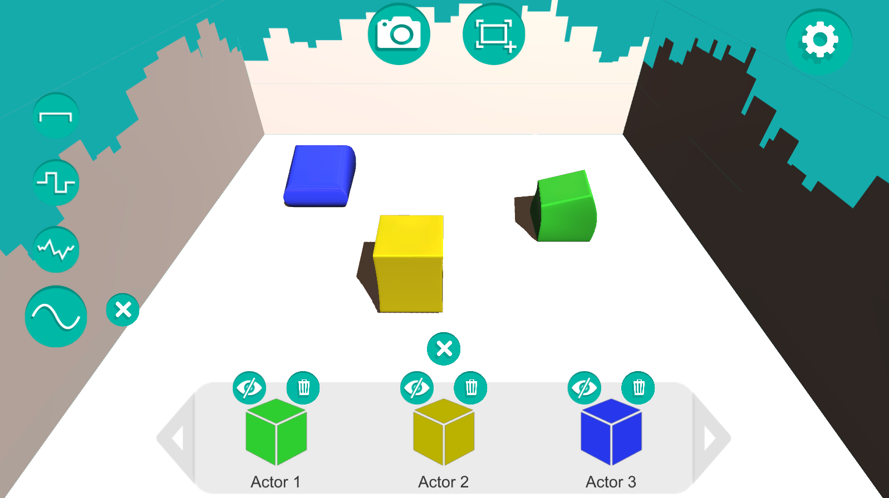
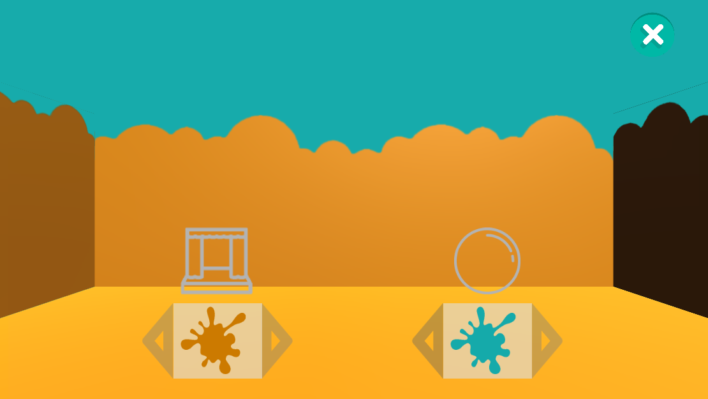
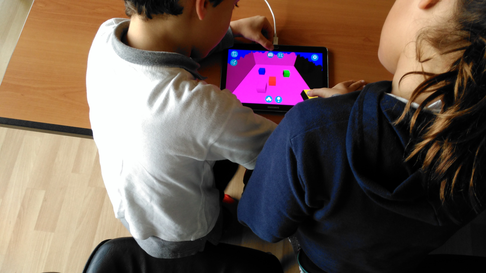

# Cubus - A serious sandbox game for stimulating creativity in children during storytelling

## About

Cubus uses autonomous synthetic characters to stimulate idea generation in groups of children during a storytelling activity. With Cubus, children can invent a story and use the stop-motion technique to create a movie of their story.
This is made possible by creating and arranging the agents in the scene as well as personalizing the surrounding scenario. Once children are happy with the setup for a particular scene they perform a screen capture. This process is repeated until the story is completely captured. These screen captures are then stitched together in any external stop-motion application to create the final movie. Additionally, in this stage children can add a voice-over to their movie. This creates the final version of children’s stop-motion movie depicting their story.
A publication discussing this work (in pdf format and named “CUBUS - IVA 2017”) is available adjacently to the playable version of the game at [Cubus publication and apk file](https://drive.google.com/open?id=0B_1xY3sxQvmZZ2pRZFBKblZPZ28).

Learning goals: Stimulating creativity in a storytelling context. In particular, Cubus promotes idea generation (called "fluency" according to creativity literature) during the storytelling activity.

Target group/Context of Use: Our end-users are children between 7 and 9 years old, which play this serious game in groups. The game is designed for a classroom context with a teacher providing assistance regarding technical aspects of Cubus sporadically throughout the activity.

## Demonstration 
### Playable version

A link to a playable version of the game: [Cubus' apk file](https://drive.google.com/open?id=0B_1xY3sxQvmZZ2pRZFBKblZPZ28)
(requires installing in an Android device.)

### Video

A video describing how Cubus’ agents work and interact with children is available below. 
This video also shows two movies that children created during a study while using Cubus to tell a story. Children had roughly one hour to acclimate to this new game and produce their stop-motion movie.

### Screenshots

Here we present a few screenshots showcasing different aspects of Cubus.

(Storytelling environment with agents, scenario and a transparent overlay resulting
from a previous capture)

(Menu listing all available agents and how children can manage them during the
storytelling)

(Color picker screen that allows selecting one color for the chosen scenario and
another for the enveloping skybox)

(A pair of children using Cubus to create a movie telling a story they created together)